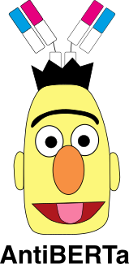

     

    
    
    
    
    
    

# AntiBERTa

This is a repository with Jupyter notebooks describing how we pre-trained the model, and how we apply the model
for fine-tuning.

## FAQs

* _What dataset did you use?_ This is described in our preprint, but briefly, we used a section of the Observed Antibody
  Space (OAS) database (Kovaltsuk et al., 2018) for pre-training, and a snapshot of SAbDab (Dunbar et al., 2014) as of
  26 August, 2021. We've included small snippets of the OAS database that we used for pre-training, and the paratope
  prediction datasets under `assets`.
  
* _Why HuggingFace?_ We felt that the maturity of the library and its straight-forward API were key advantages. Not to
mention it fits really well with cloud compute architectures like AWS.
